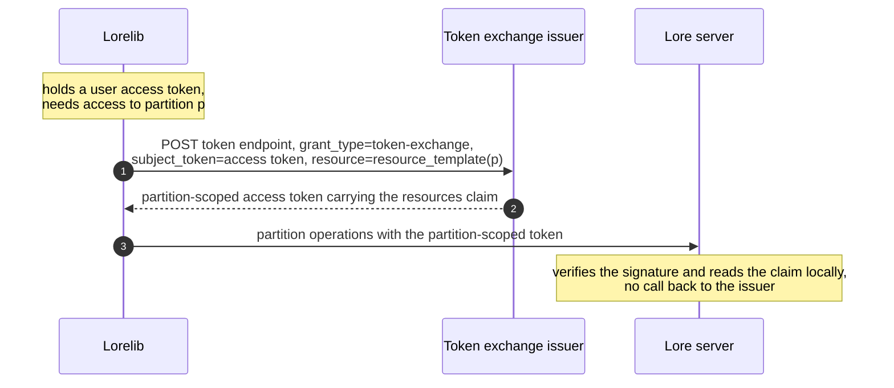
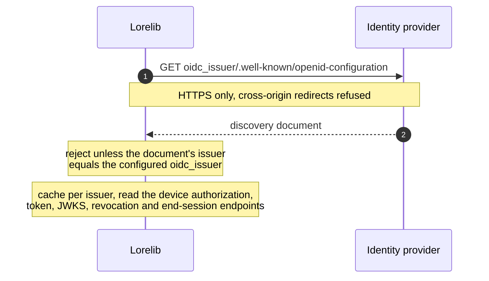
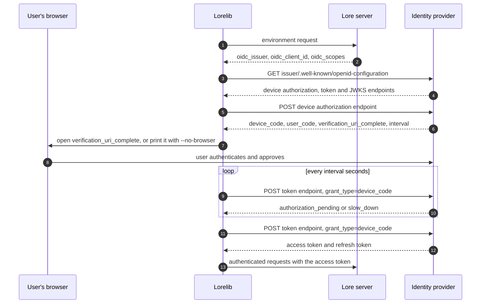
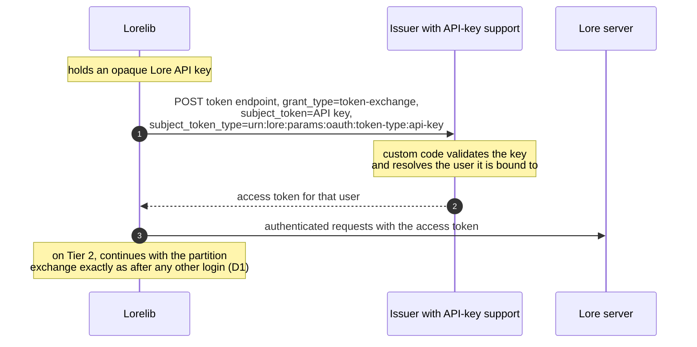
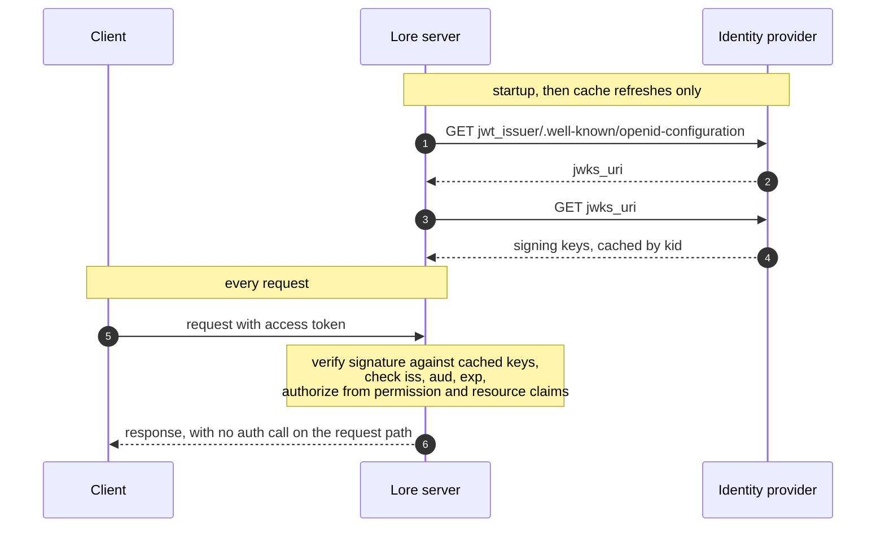
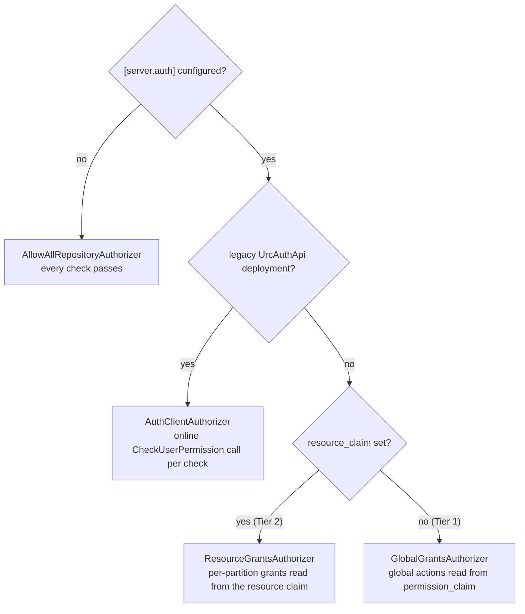

# Replace the custom authn/authz token scheme with OIDC and OAuth 2.0

## Executive summary

Lore's authentication and authorization run on a custom gRPC protocol, `UrcAuthApi`. Any
deployment that wants its own identity provider has to reimplement all 13 of its RPCs, and even
then a stock provider's tokens fail Lore's claim checks because Lore requires custom claims that
no standard provider emits. This proposal retires the custom protocol in favor of the industry
standards, OpenID Connect and OAuth 2.0, so that an operator can plug in an off-the-shelf
provider such as Keycloak, Auth0, Okta or Entra ID through configuration alone.

The most important changes from the current scheme:

- **Standard grants replace the custom RPCs.** Lorelib logs users in with the OAuth device grant
  flow, serves CI users through the client credentials flow, gains token refresh, which is absent
  today, implements API-key login as a standard token exchange, and obtains partition-scoped
  authorization tokens through the same standard token exchange.
- **The server authorizes locally.** Today the backend calls the auth service at the beginning of
  every partition operation. To make the server-side check standards-compliant, we change this to
  verify against the claims in the signed tokens. With refresh token support we can make the access
  tokens short-lived. For deployments requiring real-time checks, the `RepositoryAuthorizer`
  trait also accepts an online implementation, the existing `UrcAuthApi`-backed one included.
- **Two tiers to make deployments easy.** Tier 1 grants actions globally through ordinary
  role claims and works with every provider surveyed. Tier 2 keeps today's least-privilege model
  of tokens scoped to a single partition, for deployments whose provider can mint them, natively
  or through an extension.
- **Lore holds no signing key.** Nothing in this repository mints or signs a token. The identity
  provider does. A compromised Lore server yields no key to forge tokens with.
- **The anti-exfiltration check survives.** The client today refuses to send a token to any host
  the issuer did not name, and it keeps doing so. Only how the allowed domains are read out of the
  token changes, and the issuer stays the sole source of that list.
- **What the standards cannot answer stays pluggable.** Resolving user names, listing the
  partitions a caller may see, and the authorization decision itself have no OIDC
  or OAuth equivalent, so each lives behind a Lore trait with a working default.
- **Uses the token permission claims for all authorization decisions.** The current ad-hoc
  authorization decisions, like granting branch protection bypass based on the
  `is_service_account` claim, are all replaced with explicit permissions like `push-protected`.
- **Migration is gradual and revertible.** The old and new paths run side by side through phased
  rollout, existing deployments keep working untouched, and the gRPC API retires only when its
  last client moves. While a server advertises both paths, a client-side flag picks which one a
  caller takes, so a deployment can keep its fleet on the legacy path while individual users and CI
  jobs test the new one against the same server (D2).

The rest of this document gives the technical design: the required OIDC provider capability profile
and tier definitions (D1), discovery and configuration (D2), the grant and claim mappings (D3, D4),
the client's token anti-exfiltration send-check (D5, D6), the new traits (D7, D8), every server
enforcement point (D9), and the compatibility, migration and security analysis.

## Summary

Lore authenticates through a custom gRPC service, `UrcAuthApi`, that mints two kinds of JWT. An
*authentication* token identifies the user. An *authorization* token carries a custom `resources`
claim naming the partitions the holder may touch. Anyone who wants to run Lore against their own
identity provider has to reimplement that gRPC API. This proposal replaces the custom protocol
with OpenID Connect Discovery and standard OAuth 2.0 grants: device authorization for interactive
login, client credentials for CI, and [RFC 8693](https://www.rfc-editor.org/rfc/rfc8693) token exchange for partition scoping and for
API-key login, which survives as an exchange rather than being dropped. It defines two tiers, so
that deployments whose provider cannot mint per-partition tokens still get a working system.

**A note on terms.** Authentication and authorization in Lore apply to storage, whose unit of
access control is the *partition*. A revision-control repository is one kind of partition. This
document therefore says *partition* wherever it names the thing storage access is granted to.

## Motivation

Three problems, worst first.

**Running Lore's auth means implementing a custom gRPC API.** The client talks to
[`UrcAuthApi`](../../lore-proto/proto/auth_api.proto), a gRPC interface with 13 RPCs covering
login sessions, token exchange, permission checks, and user directory lookups. None of it follows
a published standard, so an operator who wants Lore on their own identity provider has to
implement all 13. The `Authentication` trait in
[`lore-transport/src/traits.rs`](../../lore-transport/src/traits.rs) already anticipates a second
implementation. But it mirrors the custom API methods the client uses, so writing one means
reproducing their semantics rather than adopting a standard.

**A stock provider's tokens do not decode.** The server's claim structs require claims that no
standard defines. `AuthorizationToken` in
[`lore-server/src/auth/jwt.rs`](../../lore-server/src/auth/jwt.rs) declares `env: String`,
`name: String`, `preferred_username: String` and `idp: String`, none of them `Option`. The
`JWTUserInfo` fallback it tries next declares `env`, `name` and `preferred_username` the same way.
E.g. a Keycloak access token carries neither `env` nor `idp`, and carries `name` only when the user
has a first or last name set and the client's granted scopes include `profile`. Both decodes fail,
`verify_token_internal` returns `ValidationFailed`, and the interceptor answers
`permission_denied`. The client has a milder version of the same problem:
`lore_credential::JWTUserInfo` requires `name`, so `user_info_from_token` returns `None` for a
nameless token. Login fails on that, and the other callers degrade silently — two of them by
skipping the token expiry check. This makes it hard
to use a provider except the one Lore was built against.

**The client's send-check depends on a non-standard `aud` value.**
`JWTUserInfo::acceptable_root_domains` in
[`lore-credential/src/jwt.rs`](../../lore-credential/src/jwt.rs) reads `aud` as a list of DNS root
domains, and the client's `verify_jwt_usage_for_remote` refuses to send a token to any host outside
that set. This works today because the custom auth service mints an audience containing a domain
suffix, and the server's accept-list mirrors that pairing: every environment config sets
`jwt_audience = ["URC", ".epicgames.net"]` or its per-environment equivalent, one entry for each
reading of the claim. A conforming provider will not. [RFC 9068](https://www.rfc-editor.org/rfc/rfc9068) says `aud` SHOULD carry the
`resource` value from the request, [RFC 8707](https://www.rfc-editor.org/rfc/rfc8707) requires that to be an absolute URI, and the common
alternative is a client identifier such as `lore-api`. Neither matches a hostname, so the check
fails closed against every standard provider and the token is never sent anywhere.

The server side needs no change here. Checking `aud` against a configured expected value is what
[RFC 9068](https://www.rfc-editor.org/rfc/rfc9068) asks of a resource server, and `jwt_audience` already does it. But the client cannot keep
reading every `aud` entry as a domain suffix, because a standard provider's audience is a URI or an
opaque identifier. The anti-exfiltration property is worth keeping, and the issuer has to stay its
source, so D5 keeps the check and reads the list from a dedicated claim, or from `aud` entries
whose shape supports it.

Three further gaps sit behind those:

- **The client controls the polling cadence, and the service cannot.** The interactive login polls
  on a hardcoded 5-second interval for 30 attempts
  ([`lore-revision/src/auth/login.rs`](../../lore-revision/src/auth/login.rs)), and `AuthSession`
  carries no field a service could use to say otherwise. [RFC 8628](https://www.rfc-editor.org/rfc/rfc8628) makes `interval` part of the
  device authorization response and requires a client to widen it on `slow_down`, so a conforming
  provider has no way to control the rate Lore polls it at. See D3.

- **The refresh grant is absent end to end.** `refresh_authentication` returns `NotSupported`,
  `load_refresh_token` has no caller, and `store_refresh_token` never fires either, because the
  only implementation sets `refresh_token: None` unconditionally. This costs little today, because
  the auth service issues long-lived tokens. A conforming provider's access tokens are short-lived,
  which is why the refresh grant is a P2 requirement rather than a convenience. See D1 and D3.

- **Partition authorization has no path that avoids the custom API.** `check_repository_access`
  has one real implementation, and it calls `CheckUserPermission` on the auth service
  ([`lore-server/src/authnz/repository_authorizer.rs`](../../lore-server/src/authnz/repository_authorizer.rs)),
  one new connection and round trip per query operation, with no cache. `lore repo list` reaches
  `LookupUserPermissions` the same way
  ([`lore-server/src/grpc/handlers/repository_list.rs`](../../lore-server/src/grpc/handlers/repository_list.rs)).
  Neither RPC has an OAuth 2.0 or OIDC equivalent to swap in, because the standards put the grant
  in the token and leave the resource server to decide locally against it. A deployment on a stock
  provider has nothing to answer either call, so every partition question dead-ends. See D4 for
  the claim that carries the grant instead, and D8 for the authorizers that read it.

## Goals / Non-Goals

### Goals

- Let an operator point Lore at any OpenID Connect provider meeting a stated capability profile,
  through configuration alone, and demonstrate that against more than one provider in the dev
  compose stack.
- Express every credential Lore obtains as a standard OAuth 2.0 grant response, and every claim it
  reads as a registered claim, a configurable claim path, or the one fixed claim D5 defines.
- Preserve the least-privilege property of today's partition-scoped tokens for deployments whose
  provider can support it, without making it a precondition for the rest.
- Keep no token-signing key on the auth path. Every token a deployment issues is signed by its
  identity provider, and no code path in this repository signs one.
- Keep existing `UrcAuthApi`-based deployments working through the transition.

### Non-Goals

- Replacing the relationship-based access control (ReBAC) service that holds access
  permissions, or defining how those permissions are administered. This proposal covers how a
  permission decision reaches Lore, not where it is authored.
- Sender-constrained tokens (DPoP, [RFC 8705](https://www.rfc-editor.org/rfc/rfc8705) mTLS binding).
- Changing the QUIC storage `Authorize` frame. It carries an opaque bearer token
  ([`lore-server/src/protocol/storage/authorize.rs`](../../lore-server/src/protocol/storage/authorize.rs))
  and does not care where the token came from. The authorization behind it
  does change, and D9 covers it.

## Proposed Design

### D1. A capability profile, and two tiers

Lore targets a capability profile, not a specific OIDC product. A provider qualifies when it offers:

- **P1, identity.** OIDC Discovery at `<issuer>/.well-known/openid-configuration`, a JWKS at the
  advertised `jwks_uri`, a stable `sub`, and access tokens that are JWTs, preferably following the
  [RFC 9068](https://www.rfc-editor.org/rfc/rfc9068) profile. The whole server design verifies locally and makes no call at request time, so
  a provider issuing opaque access tokens cannot be used at all.
- **P2, Lorelib grants.** The device authorization grant ([RFC 8628](https://www.rfc-editor.org/rfc/rfc8628)), which covers the browser and
  headless cases alike. Plus the refresh token grant, and the client credentials grant for CI.
- **P3, fixed audience.** Some way to place a configured, static value in `aud`, so the server can
  reject tokens minted for another service. Setting that value to the deployment's canonical URL or
  domain also feeds the client's send-check without further configuration (D5).
- **P4, dynamic resource scoping.** [RFC 8693](https://www.rfc-editor.org/rfc/rfc8693) token exchange that accepts an access request it has not
  seen before, named as an [RFC 8707](https://www.rfc-editor.org/rfc/rfc8707) `resource` indicator or an equivalent the provider honours (D2),
  and returns a token carrying that resource and the actions granted on it (D4). Both are computed
  per exchange, which is what makes P4 the hard one.

P1 through P3 are ordinary and widely implemented. P4 is not, and the authn to authz exchange is
the only part of Lore's model that depends on it. So there are two tiers, and a deployment picks
one by whether it can put something in front of Lorelib that satisfies P4.

**Tier 1, direct.** Lorelib obtains one access token for the Lore server and sends it everywhere.
The server does **not** read a resource claim in this tier. It verifies the token, then answers
every partition question through the `RepositoryAuthorizer` trait
([`lore-server/src/authnz/repository_authorizer.rs`](../../lore-server/src/authnz/repository_authorizer.rs)),
which D8 extends and D9 wires into every enforcement point.

Authorization in this tier is *global per action*, not per partition. An authenticated principal
reaches every partition the server holds, and privileged actions such as obliterate or admin are
held everywhere or nowhere, read from an ordinary role or group claim (D8). A deployment that needs
"obliterate, but only here" needs Tier 2. That is the line between the tiers, and it is why Tier 1
asks nothing of a provider beyond a claim every provider already emits.

Skipping the claim is what makes P1 through P3 sufficient. `verify_authorization`
([`lore-server/src/auth/jwt.rs`](../../lore-server/src/auth/jwt.rs)) returns `NotAuthorized`
whenever `resources` is `None`, and every enforcement point runs it (D9). A stock provider's token
carries no such claim, so it is denied everywhere. **Every provider surveyed below can be configured to meet
P1 through P3**, which makes Tier 1 the one to build first.

**Tier 2, exchange.** Lorelib narrows its access token to a partition-scoped one through [RFC 8693](https://www.rfc-editor.org/rfc/rfc8693)
token exchange, naming the partition in whichever form the deployment advertises. An [RFC 8707](https://www.rfc-editor.org/rfc/rfc8707)
`resource` indicator is the standard form and the default. A parameterized `scope` value is the
alternative, and the deployment sets exactly one of them (D2). Either way this preserves today's
least-privilege property and the answer comes back as the same `resources` claim.

As a sequence, with the default `resource` carrier:



The token exchange issuer is whatever `token_exchange_issuer` names (D2): the identity provider
itself, an extended one, or a separate token service.

Two carriers are needed because sending `resource` unconditionally fails on some providers: the
survey below finds that Zitadel rejects it, authentik answers `invalid_target`, and on Keycloak it
never reaches the exchange grant. Nothing in a provider's metadata says which form it honours, so
the deployment declares it.

Beyond that Lorelib does not care what answers, so Tier 2 has three deployment variants and one
client implementation:

- **Provider-direct.** The operator's identity provider satisfies P4 itself. No Lore-operated
  service. The survey below finds no deployable open-source provider that does this today. Also the
  commercial ones reach P4 through an extension rather than natively, so this variant is available
  rather than recommended.
- **Custom issuer.** The deployment's own auth service implements the standard endpoints itself:
  discovery, the device grant, the exchange grant, a JWKS. This is the variant for an operator
  that already runs an auth service, a `UrcAuthApi` implementation included, and the section below
  lists what such an implementation adds. The per-partition narrowing stays in the service that
  already holds the policy.
- **Provider-extension.** The operator extends their provider until it satisfies P4, putting the
  per-partition decision inside the provider rather than in a service beside it. On the commercial
  providers this is a documented product feature and the natural first choice, an Auth0 Action or an
  Okta token inline hook. On Keycloak the pieces exist but are rougher. `PARAMETERIZED_SCOPES`
  lets the operator register **one** client scope named
  `partition`, marked parameterized, with a regexp constraining the value and a repeatable flag, so
  a caller names a partition the realm has never seen as `scope=partition:<id>` and no
  per-partition registration is needed. This is the variant `scope_template` exists for. That a
  parameterized scope reaches the exchange grant and can be validated there is not an inference:
  Keycloak's own `TOKEN_EXCHANGE_DELEGATION` feature declares `PARAMETERIZED_SCOPES` and
  `TOKEN_EXCHANGE_STANDARD_V2` as dependencies in `Profile.java` and works by requesting a
  parameterized scope on the exchange, which is the shape to copy. The requested value reaches a
  protocol mapper through `getParameterizedScopeParam()`, so the mapper resolves permissions against
  whatever holds them and emits the ordinary `resources` claim. Both `PARAMETERIZED_SCOPES` and
  `TOKEN_EXCHANGE_DELEGATION` are `Type.EXPERIMENTAL`, which this variant rests on.

**All three variants produce the same claim, and that is the point.** The request carrier differs,
`resource` under provider-direct and custom issuer, a parameterized scope under
provider-extension, but every one
of them returns `resources: [{resource_id, permission}]` read through `resource_claim` (D4). The
server-side claim model does not fork per variant, and Lorelib's exchange path does not either.

#### What an existing `UrcAuthApi` implementation needs to change

Nothing in Tier 2 requires the issuer to be an off-the-shelf OIDC product. A service that already
implements the gRPC API has everything the standard interface needs: a login flow, token minting,
and per-partition grants. Supporting the new interface means serving those through standard
endpoints beside the existing RPCs. The policy and the token contents can stay as they are. The
RFCs fix none of the paths: only the discovery document's location is fixed,
`<issuer>/.well-known/openid-configuration`, and it advertises the rest as
`device_authorization_endpoint`, `token_endpoint` and `revocation_endpoint`, so the service serves
them wherever it likes. The mapping:

| Standard endpoint | Existing capability behind it |
| --- | --- |
| Discovery document and JWKS | New, and small: a JSON document naming the endpoints below, and the signing keys published at the advertised `jwks_uri`. |
| Device authorization endpoint ([RFC 8628](https://www.rfc-editor.org/rfc/rfc8628)) | The `StartAuthSession` flow. `login_url` becomes `verification_uri_complete`, and the response adds the `device_code`, `user_code`, `interval` and `expires_in` fields the RFC requires. |
| Token endpoint, device code grant | The `GetAuthSession` polling flow, answering `authorization_pending`, `slow_down`, `expired_token` or `access_denied` instead of an empty response. |
| Token endpoint, exchange with `resource` | The `ExchangeUserTokenForMultiresourceToken` logic, one resource per request from Lorelib (D2). |
| Token endpoint, exchange with a foreign `subject_token` | The `ExchangeExternalTokenForUserToken` logic, with today's `token_type` values as `subject_token_type` URIs. |
| Token endpoint, exchange with the API-key `subject_token_type` | The `ExchangeAPIKeyForUserToken` logic (D3). |
| Token endpoint, refresh grant | New work rather than a mapping: the gRPC API has no operation that accepts a refresh token. Skipping it costs a fresh login per access-token lifetime. |
| Revocation endpoint ([RFC 7009](https://www.rfc-editor.org/rfc/rfc7009)) | Optional. `lore auth logout` calls it only where the discovery document advertises one. |

The tokens themselves need three properties:

- `iss` equals the issuer URL the discovery document is served from. OIDC Discovery requires it,
  the client checks it (D2), and the server compares `iss` against the same value (D8). An issuer
  that emits a keyword today starts emitting its URL.
- Access tokens stay JWTs, and the claims keep their shape. The server reads them through
  `resource_claim` and `permission_claim` (D4), so `resources: [{resource_id, permission}]` needs
  no migration.
- The client's send-check reads its domain list from `aud` entries shaped like domains, or from
  the `root_domains` claim (D5). An audience that already carries a domain suffix keeps working
  unchanged.

The permission and directory RPCs do not move onto the OIDC endpoints. `CheckUserPermission`
and `LookupUserPermissions` stay behind `RepositoryAuthorizer` and `RepositoryCatalog` (D7, D8),
and `GetUserInfo` and `GetUserId` behind `UserService` (D7). The three directory RPCs are
extracted out of `UrcAuthApi` into a gRPC API of their own, `lore.user.v1.UserService`.

Both interfaces run side by side for the whole migration. The gRPC API keeps serving clients that
have not moved, the standard endpoints serve the ones that have, and the gRPC API retires only
when the last client moves (phase 5).

#### What providers actually support

Every open-source provider surveyed can be configured to satisfy P1 through P3, though several
issue opaque access tokens by default and need the JWT format turned on to meet P1. No deployable
one satisfies P4 without a custom extension. This is a fast-moving area and the table is a snapshot
taken 2026-08-20:

| Provider | P2 device grant | P4 [RFC 8693](https://www.rfc-editor.org/rfc/rfc8693) | P4 dynamic resource indicator |
| --- | --- | --- | --- |
| [Keycloak](https://github.com/keycloak/keycloak/pull/46763) | yes | yes (standard exchange, 26.2+) | no. Experimental, feature-flagged, resolves only to pre-registered clients |
| [Zitadel](https://zitadel.com/docs/guides/integrate/token-exchange) | yes | yes, opt-in via the Feature API (2.49+) | no. `resource` returns `invalid_target`, and `audience` must be a subset of the subject and actor tokens' own audiences, so it can only narrow |
| [Ory Hydra](https://www.ory.com/hydra) | yes | not in the open-source edition. Maintainers [confirm](https://github.com/ory/hydra/discussions/3359) it is not implemented there, and [the tracking issue](https://github.com/ory/hydra/issues/1218) is still open | no evidence of native `resource` handling |
| [Dex](https://dexidp.io/docs/guides/token-exchange/) | yes | yes, but OIDC-connector-only and no nested claim mapping | no |
| [authentik](https://docs.goauthentik.io/add-secure-apps/providers/oauth2/) | yes, with a configured device-code flow | yes, delegation from 2026.8 | no. `audience` only |
| [node-oidc-provider](https://oidc-provider.dev/) | yes | via a custom grant type | **yes**. `getResourceServerInfo(ctx, resourceIndicator, client)` maps an arbitrary indicator to audience, scopes, TTL and token format per request |

Two findings drive the design. First, P4 is missing from the deployable open-source providers and
commercial providers without additional extensions. Keycloak's
resource-indicator support merged in March 2026 behind
`Profile.Feature.RESOURCE_INDICATORS`, and it resolves a resource either as `urn:client:<id>` or by
matching a client's `resource_url` attribute, in both cases against an audience already computed
from registered clients. It narrows an audience rather than minting one, so it cannot answer for a
partition the realm has not seen. That means one registered client per partition. It also does
not reach the grant Lore needs it in: [support for the `resource` parameter in the token-exchange
grant](https://github.com/keycloak/keycloak/issues/47124) is an open follow-up, alongside custom
audiences, admin support for resource URLs, and defaults. Zitadel rejects `resource` outright. That
is why Tier 1 is the baseline, and why the custom-issuer and provider-extension variants are how
Tier 2 stays reachable.

Second, the one implementation with a dynamic hook is a library rather than a server. That makes
`node-oidc-provider` a reference provider for tests rather than a deployment target. It can
mint the per-resource tokens Tier 2 asks for, so Lorelib's exchange path has something to be
tested against that is not Lore.

One detail makes the gap smaller for Lorelib. It requests exactly **one** resource per exchange:
`exchange_for_custom_resource`
([`lore-transport/src/auth/ucs_auth.rs`](../../lore-transport/src/auth/ucs_auth.rs)) wraps a single
ID in a one-element vector, and every caller passes exactly one resource, Lorelib always a
partition. Other services on the same
API do exchange for several at once, so this is a statement about the client path rather than about
`UrcAuthApi`. Keycloak's open
[multiple-resources follow-up](https://github.com/keycloak/keycloak/issues/47128) is therefore not
on Lore's critical path, and neither is
`node-oidc-provider`'s limitation of honoring a single `resource` value. What Lore needs from
P4 is the dynamic single-resource case, which is the part providers are closest to supporting.

A coarser variant stays available where per-partition scoping is not required: [RFC 8693](https://www.rfc-editor.org/rfc/rfc8693) with
`audience` rather than `resource`, naming a pre-registered target per project or per environment.
Keycloak, Zitadel and authentik all support that today. It gives less than per-partition scoping,
and the configuration does not scale to partitions, but it needs nothing experimental. On Zitadel
it is narrower still, since `audience` must be a subset of what the subject and actor tokens already
carry and cannot introduce a new value.

#### The commercial providers

**Auth0** and **Okta** both offer a documented P4 route, which makes provider-extension a first
choice for them. Auth0's [Custom Token Exchange](https://auth0.com/docs/get-started/authentication-and-authorization-flow/token-exchange-flow)
happens "in accordance with [RFC 8693](https://www.rfc-editor.org/rfc/rfc8693)" and is "governed by a single, dedicated Custom Token Exchange
Action, which is uniquely selected based on the incoming `subject_token_type` parameter". Auth0 does
not parse the subject token itself. The Action's job is to "decode and validate the `subject_token`"
and set the user, after which the standard pipeline runs and
[`api.accessToken.setCustomClaim`](https://auth0.com/docs/secure/tokens/json-web-tokens/create-custom-claims)
emits the `resources` claim, namespaced as D4 asks for anyway: Auth0 recommends a namespace against
collisions, and a colliding claim is silently dropped rather than failing the request.

Okta also implements [RFC 8693](https://www.rfc-editor.org/rfc/rfc8693) and reaches the claim through a
[token inline hook](https://developer.okta.com/docs/guides/token-inline-hook/main/), an HTTPS
service the operator runs. Its exchange is an on-behalf-of flow over tokens its own org issued
rather than the foreign-token exchange Auth0 offers, which is fine for Tier 2, where the subject
token is the provider's own.

Both Auth0 and Okta support the device grant.

**Microsoft Entra ID** meets P1 through P3 and does not meet P4 in a natively usable form. Its
On-Behalf-Of flow is a token exchange in spirit but implements [RFC 7523](https://www.rfc-editor.org/rfc/rfc7523), using
`urn:ietf:params:oauth:grant-type:jwt-bearer` with `requested_token_use=on_behalf_of`, so a client
targeting it needs a second code path rather than the one Tier 2 defines. A `tokenIssuanceStart`
custom claims provider exists and could carry the claim, but which flows it fires on is not stated
in its documentation and needs testing. Tier 1 is unaffected. Tier 2 needs either that hook proven
out or a separate exchange service named by `token_exchange_issuer` (D2).

**AWS Cognito** is the one provider in either survey that fails **P2** natively. Its token endpoint
documents `grant_type` as ["`authorization_code` or `refresh_token` or `client_credentials`"](https://docs.aws.amazon.com/cognito/latest/developerguide/token-endpoint.html)
and returns `unsupported_grant_type` for anything else, so there is no device grant and no [RFC 8693](https://www.rfc-editor.org/rfc/rfc8693).
AWS's answer for implementing device grant is a [Lambda and DynamoDB sample](https://github.com/aws-samples/cognito-device-grant-flow).

Cognito is nonetheless the only provider surveyed anywhere that implements [RFC 8707](https://www.rfc-editor.org/rfc/rfc8707) natively:
[resource binding](https://docs.aws.amazon.com/cognito/latest/developerguide/cognito-user-pools-define-resource-servers.html)
takes a `resource` parameter, validates it as a URL, and "sets the requested URI as the audience in
the `aud` claim of the access token", one resource per request, which is exactly the shape Tier 2
wants. It is unusable for Tier 2 regardless, because it is offered only at the authorize endpoint
under managed login and there is no exchange grant to carry it. So a Cognito deployment needs a
separate service in front of it for interactive login before Tier 2 even comes up. This proposal
does not provide one.

#### Proving P4 is implementable

P4's absence is a gap in what providers have built, not in what the specifications allow. [RFC 8693](https://www.rfc-editor.org/rfc/rfc8693)
§2.1 supports `resource` explicitly, and [RFC 8707](https://www.rfc-editor.org/rfc/rfc8707) defines its handling. Tier 2 should rest on a
demonstration rather than on that reading, and one is cheap enough to include.

`node-oidc-provider` implements [RFC 8707](https://www.rfc-editor.org/rfc/rfc8707) natively. Only [RFC 8693](https://www.rfc-editor.org/rfc/rfc8693) is missing, and it exposes
`registerGrantType()` for exactly this. A token-exchange grant that validates a subject token and
hands the resource to the existing `getResourceServerInfo` hook is about a hundred lines.
That is a minimal extension to a real OIDC implementation, enough to show P4 is buildable.

Extending a *deployable* provider would prove more, and this proposal does not attempt it.
Keycloak would be the candidate, since the merged work added a `TokenPostProcessor` hook and the
`RESOURCE_INDICATORS` feature, and its follow-ups ([resource
validation](https://github.com/keycloak/keycloak/issues/47116), since closed for 26.6, and
[per-client opt-in](https://github.com/keycloak/keycloak/issues/47121), still open) are the same
gaps a URI-template resolver would fill. Zitadel is the alternative, where maintainers have asked publicly whether the
feature is wanted. Either is a separate proposal. Lore must not require such an extension, and the
custom-issuer and provider-extension variants already cover the capability for real deployments.

The reference provider is in scope for this proposal rather than aspirational. Tier 2's client path
has to be tested against something that is not Lore, or one deployment's issuer becomes the
definition of correct by default.

### D2. Discovery replaces the auth-URL scheme

Today the client picks an `Authentication` implementation by parsing the `auth_url` scheme
([`lore-transport/src/auth/mod.rs`](../../lore-transport/src/auth/mod.rs)). That no longer
discriminates: deployments advertise `https://` URLs, and `https` is registered as a transition
fallback to `UcsAuthentication`, so an OIDC issuer, which is an `https://` URL by definition, cannot
be told apart by scheme. Selection therefore keys on the presence of `oidc_issuer` below, gated
during the migration by the opt-in described at the end of this section, and the scheme registry
keeps serving the legacy path only.

`lore.environment.v1.Endpoint`
([`environment.proto`](../../lore-proto/proto/lore/environment/v1/environment.proto)) gains fields,
all additive. This is the message the current client reads, through
[`environment_client.rs`](../../lore-transport/src/grpc/environment_client.rs). The server populates
them from `[environment.endpoint]`, the same table that holds `auth_url` today, so these are what
an operator advertises rather than what the server enforces. The enforcement settings are
`[server.auth]` in D8.

| Field | Meaning |
| --- | --- |
| `oidc_issuer` | Issuer URL. The client fetches `<issuer>/.well-known/openid-configuration`. |
| `oidc_client_id` | The public client ID Lorelib presents. |
| `oidc_scopes` | Default scopes to request. |
| `oidc_preferred` | Whether a client that expresses no preference should take the OIDC path. Absent or false keeps it on `auth_url` while both are advertised. |
| `resource_template` | How to name a partition as an [RFC 8707](https://www.rfc-editor.org/rfc/rfc8707) resource, for example `https://lore.example.com/partitions/{id}`. The standard form and the default. |
| `scope_template` | How to name a partition as a scope value instead, for example `partition:{id}`. For providers that reject `resource` or never see it on the exchange grant. |
| `token_exchange_issuer` | The [RFC 8693](https://www.rfc-editor.org/rfc/rfc8693) endpoint to exchange against, whether that is the provider itself or a separate token service. |
| `identity_claim` | The claim clients record as the user identity, `sub` by default (D7). Advertised so every client records the same form. |
| `user_url` | The user directory clients resolve names at, `auth_url` by default (D7). Independent of the auth path, so an OIDC deployment can advertise a directory without a legacy auth service. |

The list of hosts a token may be sent to is deliberately *not* advertised here: it comes from the
issuer-signed token, because the environment response is served by the same party a stolen token
would be replayed against (D5).

Both templates name partitions only. `exchange_for_custom_resource` keeps taking a verbatim
resource string, so callers that exchange for other kinds of resources pass their value through
unchanged.

Tier 2 needs `token_exchange_issuer` plus exactly one of `resource_template` and `scope_template`.
None of them set selects Tier 1. A template without the issuer, or the issuer without a template, is
a startup error rather than a fall back to Tier 1: falling back silently would discard the
least-privilege property the operator was trying to configure, without saying so. Both templates set
is also a startup error, because sending both carriers is what fails on a provider that rejects
`resource`, so there is no configuration in which it is the safe choice.

The client fetches the discovery document over HTTPS, refuses cross-origin redirects, and checks
that the `issuer` inside it equals the configured issuer it fetched from. That check is what stops
a hijacked or substituted document from pointing token requests somewhere else, and it is the same
rule a custom issuer has to satisfy (D1). The client then caches the document
per issuer and reads `device_authorization_endpoint`, `token_endpoint`, `jwks_uri`,
`revocation_endpoint` and `end_session_endpoint` from it. The server
reads `jwks_uri` from the same document rather than requiring `[server.auth.jwk].endpoint` to be
spelled out, and keeps the explicit setting as an override for providers with non-standard
discovery.



The Lore server runs the same fetch against `jwt_issuer` to resolve `jwks_uri`, shown in D8.

#### Which path a client takes while both are advertised

A server on phases 3 and 4 advertises `auth_url` and `oidc_issuer` at once. Taking the OIDC path
just because it is advertised would move a whole fleet the moment an operator adds the field, so a
client-side setting, `auth_mode`, chooses instead. It takes `legacy`, `oidc` or `auto`, and `auto`
follows the new `oidc_preferred` field in the environment response. An operator therefore leaves
the default on the legacy path while a few people test the new one, then flips the whole fleet
without a client release. Asking for a path the server does not advertise is a configuration error
rather than a silent fall back to the other one.

`auth_mode` is a global CLI flag rather than a `lore login` flag, since every operation that
touches auth needs it, and it reads from `LORE_AUTH_MODE` and the per-user `config.toml` as well,
so a tester opts in once instead of per command. The library carries the same value in
`LoreGlobalArgs`, which is what lets one CI job or one embedding move on its own. The token store
keys entries by the endpoint that issued them, so a switch in either direction leaves the other
path's credentials intact. The setting retires with the legacy path in phase 5.

### D3. Standard grants replace the custom RPCs

| Today | Replacement |
| --- | --- |
| `StartAuthSession` returning `{session_code, login_url}` | [RFC 8628](https://www.rfc-editor.org/rfc/rfc8628) device authorization request. `login_url` comes from `verification_uri_complete`, `session_code` from `device_code`. |
| `GetAuthSession` polling | [RFC 8628](https://www.rfc-editor.org/rfc/rfc8628) token request, `grant_type=urn:ietf:params:oauth:grant-type:device_code`. Honors `interval`, `slow_down`, `expired_token`, `access_denied`. |
| `ExchangeAPIKeyForUserToken` | [RFC 8693](https://www.rfc-editor.org/rfc/rfc8693) token exchange with a Lore-specific `subject_token_type` naming the API key. Keeps the user binding, which `client_credentials` cannot express. See below. |
| `ExchangeExternalTokenForUserToken(token, token_type)` | [RFC 8693](https://www.rfc-editor.org/rfc/rfc8693) token exchange. `token_type` becomes a `subject_token_type` URI. |
| (new) | `client_credentials` grant, for machine identities registered at the provider. Nothing migrates onto it. It is what a deployment on a stock provider uses for CI. |
| `ExchangeUserTokenForMultiresourceToken(resource_id[])` | [RFC 8693](https://www.rfc-editor.org/rfc/rfc8693) token exchange with `resource` ([RFC 8707](https://www.rfc-editor.org/rfc/rfc8707)) naming the partition, or the verbatim resource for non-partition callers (D2). Sent to whatever `token_exchange_issuer` names. |
| `RefreshAuthSession` | `refresh_token` grant. Fills in `Authentication::refresh_authentication`, which currently returns `NotSupported`. |
| `GetUserInfo`, `GetUserId`, `GetProviderUserId` | Moves off the auth path entirely, see D7. `GetProviderUserId` maps an internal ID to the upstream provider's ID. With an external issuer the provider's `sub` *is* the ID, so it has no successor. |
| `CheckUserPermission` | Stays as a `RepositoryAuthorizer` implementation rather than part of the standard set, see D8. |
| `LookupUserPermissions` | A paginated search over a permission store, which no standard endpoint offers. Moves to the optional `RepositoryCatalog` trait, see D7. |
| `VerifyUser` | Asserts a user satisfies a named compliance requirement. No OAuth 2.0 equivalent, and no caller in this repository, so it gets no successor until one is needed. A deployment that needs it grants an action and checks it through `RepositoryAuthorizer`, the way `obliterate` works (D4, D8). |
| `HealthCheck` | No successor needed. The provider's discovery document serves as the liveness probe. |
| (new) | [RFC 7009](https://www.rfc-editor.org/rfc/rfc7009) revocation on `lore auth logout`. |

That accounts for all 13 RPCs in
[`auth_api.proto`](../../lore-proto/proto/auth_api.proto).

#### Which artifact is which

Lore's "authentication token" is an OAuth 2.0 **access token**, not an OIDC ID token. It travels as a
`Bearer` credential to `JWTAuthnInterceptor`, and it is presented to the auth service to obtain the
partition-scoped token. Both are access-token behavior. An ID token is for the client to consume and
must never be sent to an API. Concretely:

- Lorelib stores the access token and the refresh token. It does not store or transmit an ID token.
  If a provider returns one, the client may read `name` and `preferred_username` from it for
  display and then discard it.
- `subject_token_type` in every exchange is `urn:ietf:params:oauth:token-type:access_token`, and
  whatever serves the exchange validates the `subject_token` as an access token.

#### The device grant alone replaces today's login flow

Today's login flow already works like a device grant, and the device grant replaces it
directly. It preserves the cross-machine case, keeps `--no-browser` support, and needs no
local listener.

The full login, every call a standard one:



Lorelib requests `offline_access` on every login. Providers differ on whether a refresh token
outlives the SSO session without it, and a credential that dies when the user closes their browser
would send people back through login far more often than today's token store does.

The `Authentication` trait needs two changes to carry this. `AuthSession` gains `user_code`,
`interval` and `expires_in`, because [RFC 8628](https://www.rfc-editor.org/rfc/rfc8628) lets the server set the polling cadence and the
client currently hardcodes 5 seconds by 30 attempts in
[`lore-revision/src/auth/login.rs`](../../lore-revision/src/auth/login.rs). And `poll_auth_session`
returns a three-state result rather than `Option`, because `slow_down` must widen the interval and
`access_denied` must stop the loop, and today both are indistinguishable from "not yet". The
`acceptable_root_domains` field on `AuthenticationToken` stays, populated by D5's derivation
instead of by concatenating `iss` and `aud`.

#### API key login implemented as a token exchange

API key login works like a token exchange: an opaque string in, an authentication
token for a known user out. [RFC 8693](https://www.rfc-editor.org/rfc/rfc8693) is built for exactly that. Section 3 notes that exchange
"can work with both tokens issued by other parties", where "the token type identifier indicates the
syntax… so the authorization server can parse it", and states that beyond the identifiers it
defines, "Other URIs MAY be used to indicate other token types". So an API key exchange is
`subject_token_type: urn:lore:params:oauth:token-type:api-key` against the same endpoint as every
other exchange, and Lorelib needs no separate code path.



Validating a Lore API key needs custom code that knows about them: a custom issuer (D1), or a
provider whose exchange grant can be extended.
Auth0's Custom Token Exchange is built for exactly this shape, an opaque
subject token behind a custom `subject_token_type`. Not every exchange grant implementation will do:
Okta's accepts only subject tokens its own org issued. For the rest there is `client_credentials`,
where a CI instance authenticates with a client id and secret.

### D4. Claim model

| Custom claim | Replacement |
| --- | --- |
| `resources: [{resource_id, permission}]` | A namespaced custom claim carrying `{resource, actions}` entries, the same structure under names a provider can be configured to emit. `resource_claim` names the claim, `resource_id_claim` names the resource field within an entry (`resource_id` by default) and `permission_claim` names the actions (`permission` by default). All three field names are configuration because some providers cannot change their entry shape — Keycloak's UMA `permissions` entries carry `rsname` and `scopes` — and configuring only some of the shape would be worse than configuring none of it. `permission_claim` also answers the Tier 1 case, where actions are read without a resource beside them (D8). See below. |
| `is_service_account` | Dropped from the server's decision path. Every reader becomes an action check through `RepositoryAuthorizer` (D8), the way obliterate already works. See below. |
| `name`, `preferred_username` | Already standard OIDC claims. Made optional (D6). |
| `env` | Unused in any decision path. Dropped. |
| `idp` | Unused in any decision path. Dropped. |

`verify_authorization` ([`lore-server/src/auth/jwt.rs`](../../lore-server/src/auth/jwt.rs)) becomes
a lookup against whichever claim the configuration names, comparing whatever `resource_id_template`
renders for the partition. That is a separate setting from D2's `resource_template`, because the
two forms differ: the client asks with an absolute URI as [RFC 8707](https://www.rfc-editor.org/rfc/rfc8707) requires, while the value inside
the claim is whatever the issuer puts there, still `urc-{id}` for an issuer that keeps today's
values. Tier 1
stops reaching it at all (D1). The `urc-*` wildcard keeps working as a configurable wildcard value
for `UrcAuthApi` deployments, and starts working consistently: today only `matches_repository`
honours it, so `can_admin_lock` sees a wildcard grant while `can_obliterate` and `is_owner_or_admin`
silently do not, and their `user_permissions` reader stops at the first matching entry instead of
merging duplicates. One reader means one behaviour, and the wildcard is honoured everywhere.

The table above is also a rule for the future, so the tokens do not drift back toward a dialect
only one issuer can mint. A claim added after this proposal is either a registered claim from the
[IANA JWT registry](https://www.iana.org/assignments/jwt/jwt.xhtml) or a custom claim under a
collision-resistant namespaced name ([RFC 7519](https://www.rfc-editor.org/rfc/rfc7519) §4.2), it
must be something a stock provider can be configured to emit, and it stays optional to decode, so
a token without it keeps verifying (D6).

#### The claim carries actions, not just identity

The resource claim is Tier 2's mechanism, and Tier 1 reads no resource claim at all (D1). Both
tiers answer the same *question*: `check_repository_access(token, repository, action)` is asked
identically at every enforcement point, and the tier decides who answers it. Under Tier 2
`ResourceGrantsAuthorizer` answers from this claim. Under Tier 1
`GlobalGrantsAuthorizer` answers the same question from a global action set read out of a
role or group claim, ignoring which partition was asked about (D8). The action vocabulary is
common to both tiers. What differs is whether an action is scoped to a partition or held
everywhere.

`resources` is a list of `{resource_id, permission}` pairs, and the server reads the permission
half. Both readers live in
[`lore-server/src/grpc/mod.rs`](../../lore-server/src/grpc/mod.rs): `get_matching_permissions`
feeds `has_required_permission`, which `can_admin_lock` calls for `migrate`, and `user_permissions`
is read directly by `can_obliterate` for `obliterate` and by `is_owner_or_admin` for `owner` or
`admin`.

#### `is_service_account` becomes explicit actions

This part applies to both tiers. Five call sites read `is_service_account` today, in three groups.
Branch push and repository delete each have a v0 and a v1 handler carrying the same check, and
although both groups share a `bypass_protection` variable they waive different things:

| Call site | What the flag waives today | Becomes |
| --- | --- | --- |
| `branch_push.rs`, [v0](../../lore-server/src/grpc/handlers/branch_push.rs) and [v1](../../lore-server/src/grpc/revision/v1/branch_push.rs) | The `PROTECT` flag on branch metadata, so a push to a protected branch succeeds instead of returning `permission_denied("protected")`. | `push-protected`, a new action. |
| `repository_delete.rs`, [v0](../../lore-server/src/grpc/handlers/repository_delete.rs) and [v1](../../lore-server/src/grpc/repository/v1/repository_delete.rs) | The creator check, `metadata.creator != user_id`, so a partition can be deleted by someone who did not create it. | `owner` or `admin`, both already in use. The check it waives is an ownership check, and `is_owner_or_admin` is the existing reader for exactly that question. |
| [`presign_repository_content.rs`](../../lore-server/src/http/repositories/repository/contents/content/presign_repository_content.rs) | Nothing. Here the flag is the whole gate on issuing a presigned URL. | `presign`, a new action. |

A Tier 2 deployment grants these per partition in the resource claim. A Tier 1 deployment grants
them globally through a role. One behavior to preserve: with no verifier configured the presign
gate is open today, and the `AllowAllRepositoryAuthorizer` default keeps it that way.

### D5. The domain check keeps its logic, and the issuer keeps the list

`verify_jwt_usage_for_remote` protects against a client that has collected tokens for several hosts
handing the wrong one to the wrong host. That property is worth keeping, and so is the mechanism,
suffix match included: one token is deliberately valid across several services under the
deployment's domain, relays included, so the issuer grants a domain rather than a host. What has to
change is only how the list is read out of the token: today
`JWTUserInfo::acceptable_root_domains` concatenates `iss` and `aud` and treats every entry as a
domain, and no standard provider will put a DNS suffix in either.

The list must keep coming from the issuer. It cannot come from the deployment's own environment
response, tempting as that is: the environment response is served by the same party a stolen token
would be replayed against. A rogue server could advertise the victim's issuer plus its own domain,
let the user complete a legitimate login, and collect a token valid on the victim's servers. Only
the issuer can say where its tokens may go, which is exactly the property the custom scheme has
today.

Two sources, both inside the issuer-signed token, tried in order:

- **A dedicated claim.** `root_domains`, a list of root-domain suffixes and hosts in the form the
  client already matches against. The client reads it under that fixed name and under a fixed
  namespaced alias, `https://lore.org/claims/root_domains`, for providers that require namespaced
  custom claims. The namespace is a collision-resistant name under a project-controlled domain
  ([RFC 7519](https://www.rfc-editor.org/rfc/rfc7519) §4.2), never fetched. The name is fixed rather than configurable, so nothing in an
  attacker-controlled environment response can point the client at a different claim. A static-value claim is plain
  configuration on nearly every surveyed provider: a hardcoded-claim mapper on Keycloak, one
  `setCustomClaim` line in an Auth0 Action, a static custom claim on Okta, a property mapping on
  authentik, an Action on Zitadel.
- **`aud`, where its entries have a usable shape.** An entry that parses as an `https` URI
  contributes its host, and an entry shaped like a domain contributes a suffix, as today. Opaque
  identifiers such as `lore-api` contribute nothing. [RFC 9068](https://www.rfc-editor.org/rfc/rfc9068) wants the resource URI in `aud`, so
  P3's static audience does double duty when the operator sets it to the deployment's canonical URL
  or domain, with no extra provider configuration. This rule is also what keeps existing
  `UrcAuthApi` tokens working unchanged: `aud = ["URC", ".epicgames.net"]` yields exactly the
  suffix it does today.

A custom issuer may additionally publish the list in its discovery document, which the client
fetches issuer-verified (D2). Hosted providers cannot extend theirs, so that stays an option for
issuers the deployment controls rather than the baseline.

When neither source yields a domain, the token may be sent only back to the token endpoint it came
from, which the [RFC 8693](https://www.rfc-editor.org/rfc/rfc8693) exchange needs, and login fails with a configuration error naming the two
fixes. Failing closed here is the point: defaulting to any server-advertised host would reopen the
hole.

That is deliberately a small change. `store_user_token`
([`lore-credential/src/token_store.rs`](../../lore-credential/src/token_store.rs)) already takes
the domain list as a parameter, so its callers pass this derivation instead of `iss` plus `aud`:
three in
[`lore-revision/src/auth/login.rs`](../../lore-revision/src/auth/login.rs) and two in
[`lore-transport/src/auth/exchange.rs`](../../lore-transport/src/auth/exchange.rs), which also runs
`verify_jwt_usage_for_remote` against the exchanged token before storing it, using the same
derivation. The exchange pair is the Tier 2 path and works by the same rules: an authz token's
`aud` carries the resource URI, whose host is where the token is meant to go, and a provider that
copies the `root_domains` claim through the exchange widens that to the deployment's domain.
`IdentityToken.acceptable_root_domains`, the on-disk format, `domain_in_root_domains`, the
`tokens_only_for_recipient_domain` selection predicate and the whole domain test suite stay as they
are.

Two existing behaviors carry over unchanged. `store_user_token` appends the auth endpoint's own
domain to the list, described in the code as a work-around for the auth service's issuer being a keyword
rather than a domain. That is also what keeps the [RFC 8693](https://www.rfc-editor.org/rfc/rfc8693) exchange working, since the token
genuinely does go back to the token endpoint. And in the store's selection predicate, an entry
whose list is empty matches any recipient, a compatibility shim for clients that predate the
field. Neither needs to change, because the field is not new and its meaning is not changing. The
appended endpoint domain is also what implements the fail-closed case above: with no claim and no
usable `aud`, it is the only entry in the list.

### D6. Claim tolerance

Every claim struct the two crates deserialize into becomes tolerant of a stock provider's output.
On the server `name`, `preferred_username`, `env` and `idp` become `Option`. On the client `name`
becomes optional too, `preferred_username` being optional there already. And
`AuthorizationToken`'s required set narrows to `iss`, `sub`, `aud`, `exp` and `iat`, with
`client_id` read where present.

That is deliberately *less* than the [RFC 9068](https://www.rfc-editor.org/rfc/rfc9068) profile, which makes seven claims REQUIRED, adding
`client_id` and `jti`, and whose §4 says a resource server MUST reject a token whose `typ` is not
`at+jwt` or `application/at+jwt`. Requiring the full set would reject the tokens the legacy auth
service issues, which is the one thing phase 1 must not do. So the server requires the five that
every issuer in play already emits, and treats the profile's extras as checks a deployment can turn
on rather than as preconditions. `typ` enforcement is a setting, and `jti` matters only to a
deployment doing replay detection, which is not done today. The list of required fields can be
extended after the legacy deployment support is no longer needed.

Widening also deletes code. `verify_token_internal` decodes `AuthorizationToken`, and on failure
falls back to decoding `JWTUserInfo` and rebuilding an `AuthorizationToken` from it with
`resources: None`. That fallback exists for one reason: `idp` is the only field
`AuthorizationToken` requires that an authentication token does not carry, `resources` and
`groups` being `Option` already. Once every non-registered field is `Option`, `AuthorizationToken`
is a strict superset of `JWTUserInfo` and the second decode is unreachable. The server's
`JWTUserInfo` has no other use, appearing only in that decode and two test helpers, so phase 1
deletes the struct along with the fallback.

This change stands alone. It is small, it is a strict widening, and no token that verifies today
stops verifying. Until it lands, nothing else in this proposal can be tested against a real
provider, so it ships first.

### D7. The two lookups with no standard successor become optional traits

Two of the custom RPCs ask questions no OAuth 2.0 or OIDC endpoint answers, and they fail the same
way for the same reason. A token carries a grant: neither standard offers a way to *search* the
grant space, or to resolve an identifier that is not the bearer's. Both therefore move off the
authentication path onto optional traits with a degraded default, rather than being forced into a
mechanism that cannot hold them.

#### The user service

`GetUserInfo` resolves a batch of user IDs to display names, and `GetUserId` resolves the reverse.
OIDC has no equivalent, because `/userinfo` describes only the bearer. Nothing in the standard set
replaces these.

The design moves them off the `Authentication` trait onto a separate optional `UserService`
trait. The default implementation answers from the token's own `name` and `preferred_username`
claims for the current user, and returns the raw ID for anyone else. The CLI already degrades to
printing the ID when no name resolves
([`lore-client/src/cli/commands/auth.rs`](../../lore-client/src/cli/commands/auth.rs)), so that
path is exercised today.

Where Lore displays *another* user's name, such as a revision author or a lock holder, the lookup
cannot be avoided. Revision metadata records the user identifier and deliberately not the
name (`created_by` and its siblings in
[`lore-revision/src/revision.rs`](../../lore-revision/src/revision.rs)), so that the identifier can
be unmapped from a person without rewriting history.

The directory lookup therefore stays a real dependency for any deployment that wants names, and
OIDC does not supply one. Deployments with a directory can implement `UserService` over it, SCIM
2.0 being the nearest standard, but out of scope for this change. Deployments without a
`UserService` implementation show identifiers.

The lookup runs on the client and bypasses the Lore server, which keeps personal information out
of it. So the directory is discovered like the auth service: the server advertises
`user_url` on the endpoint, `auth_url` when absent, and the client selects the
`UserService` implementation from that URL. The directory's host must be under a domain that is
found in one of the token's `aud` names.

The directory operations outlive the auth service, so they get a gRPC API of their own:
`lore.user.v1.UserService`, carrying `GetUserInfo`, `GetUserId` and `LookupUserPermissions` with
their messages copied field for field from `auth_api.proto`. The copy is wire-identical for
simple migration.

There is a third position for deployments that do not need the unmapping property: record a
human-readable claim as the identity itself. Nothing in the protocol constrains what `created_by`
holds, so a setting, `identity_claim`, names the claim used as the user identity, `sub` by
default, `preferred_username` for a deployment that wants readable history with no directory at
all. The server advertises the value in the environment response so every client records the
same form (D2), and reads it from `[server.auth]` for its own creator and ownership comparisons
(D8). The same setting serves providers whose `sub` is a poor durable identity, such as Entra ID,
where `sub` is pairwise per client application and the stable identifier is `oid`. Choosing a
human-readable claim is an explicit opt-in with two costs: names become permanent in history, and
claims other than `sub` are not guaranteed unique or immutable, so a rename forks a user's
identity and a reused username collides with its previous holder.

#### The repository catalog

`lore repo list` resolves "which partitions may I see" through `LookupUserPermissions`, in both
the [v0](../../lore-server/src/grpc/handlers/repository_list.rs) and
[v1](../../lore-server/src/grpc/repository/v1/repository_list.rs) handlers. That request
defines `resource_filter`, `page_size` and `page_token`, though the current caller sets only the
filter: it is a search over a permission store, not a question about the caller's token.

No token can answer it. A Tier 2 access token contains one partition, because Lorelib
requests exactly one resource per exchange (D1), and `lore repo list` has no partition
to exchange for in the first place, since discovering them is the point of the
call. Enumeration therefore requires its own optional trait, `RepositoryCatalog`.

The default implementation answers from `baseline_access` (D8): `denied`, the default, lists
none, and `reachable` lists every partition the server holds. The secure option is the default
so the disclosing one is an explicit choice. A server with no `[server.auth]` at all keeps
listing everything it holds, as a local server does today. That setting exists for this trait
alone and gates no access decision. A `UrcAuthApi` deployment gets an implementation that calls
`LookupUserPermissions` and behaves exactly as today.

The choice is not bound to the authorizer. `repository_catalog` in `[server.auth]` names the
catalog (`baseline` or `auth_service`) and `repository_catalog_url` the endpoint the auth-service
catalog asks; absent, the catalog follows `auth_url`, set meaning the auth service and unset the
baseline. So a Tier 1 or Tier 2 deployment whose auth service accepts its tokens keeps the
`LookupUserPermissions` catalog, and a `UrcAuthApi` deployment can list from the store instead.
The catalog forwards the caller's own token, so the endpoint has to accept the tokens the server
verifies. No client-side check is needed for that forwarding: the client's send-check (D5)
already confines a token to servers under its `aud`, and the server it reaches holds the token
in full either way.

`reachable` enumerates through the path `lore repo list` already takes when no auth service is
configured, `list_local` over `KeyType::RepositoryId`
([`lore-revision/src/repository.rs`](../../lore-revision/src/repository.rs)), so the query is not a
new one. What changes is that it becomes the answer for every authenticated caller on a real
deployment rather than only for a local server, so it has to stay fast as the partition count
grows. The file-based store answers it directly and can stay as it is. `AwsMutableStore::list`
answers the same call as a paginated DynamoDB query
([`lore-aws/src/store/mutable_store.rs`](../../lore-aws/src/store/mutable_store.rs)). It might
need an index or a cached inventory to make it performant. The trait keeps the
`page_size` and `page_token` fields `LookupUserPermissions` already defines, so a large listing can
be paged if needed.

### D8. Server verifier, and how each tier authorizes

#### Verification and settings

[`lore-server/src/auth/jwk.rs`](../../lore-server/src/auth/jwk.rs) needs less work than anything
else here. It already fetches a JWKS, caches by `kid`, pins the algorithm to the key rather than
the header, bounds the response, throttles refreshes, and recovers from a key rotated under an
unchanged `kid`. It gains .well-known discovery-based `jwks_uri` resolution and keeps everything else.

The provider is never on the request path. The server calls it at startup and on cache refresh
only, and answers every request from the token alone:



Discovery needs no new setting, because `[server.auth]` already names the issuer. `jwt_issuer` is
documented as the expected `iss` claim, and under OIDC that is the same string as the discovery
issuer: OIDC Discovery §4.3 requires the `issuer` inside the document to equal the URL used as the
prefix to fetch it, and [RFC 9068](https://www.rfc-editor.org/rfc/rfc9068) §4 requires the resource server to check `iss` against exactly
that. So when `jwt_issuer` holds an https URL the server fetches
`<jwt_issuer>/.well-known/openid-configuration`, takes `jwks_uri` from it, and goes on comparing
`iss` against the same value. `[server.auth.jwk].endpoint` stays as the override for providers with
non-standard discovery.

`[server.auth]` therefore gains `permission_claim`, `baseline_access`, `repository_catalog`,
`repository_catalog_url`, `resource_claim`, `resource_id_claim`, `resource_id_template`,
`resource_wildcard` and `identity_claim` (D7, `sub` by default, compared wherever the server
checks a recorded identity). `permission_claim` is
exercised from phase 2 onwards, because it is what Tier 1 runs on. `baseline_access` steers only
what the default `RepositoryCatalog` lists (D7), never an access decision. The other four only
matter once a per-partition claim is in play, so phase 4 for a new deployment and immediately for
a `UrcAuthApi` one. There is no service-account setting, because D4 turned that check into two
ordinary actions.

#### `RepositoryAuthorizer` answers every partition question

`RepositoryAuthorizer` changes signature and gains two implementations. The signature changes are
needed because D1 made Tier 1 answer every partition question through this trait:

```
struct VerifiedToken<'a> { raw: &'a str, claims: &'a AuthorizationToken }

check_repository_access(token: Option<&VerifiedToken>, repository: RepositoryId,
                        action: Option<&str>) -> Result<(), Status>
```

Two changes from today's `check_repository_access(authorization: Option<String>, repository_id)`:

- **The verified token, both halves of it.** Today the trait takes the raw `Authorization` value,
  which suits `AuthClientAuthorizer` because it forwards that value upstream to
  `CheckUserPermission`. An implementation that answers from claims cannot use it without
  re-parsing and re-verifying a token the interceptor already verified. Neither half alone serves
  both: `AuthorizationToken` holds claims and no copy of the original JWT, and a JWT cannot be
  reconstructed from claims. So the parameter carries both, the claim readers use `claims`, and
  `AuthClientAuthorizer` forwards `raw` unchanged. The `Option` stays because it means something
  distinct: `None` is a deployment with no verifier configured, which is what
  `AllowAllRepositoryAuthorizer` exists for. The axum middleware already passes such requests
  through with an empty token extension, and keeps doing so.
- **An action.** `can_admin_lock`, `can_obliterate` and `is_owner_or_admin` (D4) ask whether a
  *particular action* is allowed, as do the `push-protected` and `presign` checks that replace
  `is_service_account` (D4). Under Tier 2 the answer comes from the resource claim. Under Tier 1
  there is no resource claim, but a Tier 1 token will carry these as global permissions in
  `permission_claim`. A Tier 1 token that carries none of those permissions is denied those
  operations, and a token that carries one holds it across every partition. `None` is the plain
  reachability question the existing call sites ask. `AllowAllRepositoryAuthorizer` ignores
  the action and permits it, which is what keeps a server with no `[server.auth]` able to do
  everything locally.

The two implementations:

- `ResourceGrantsAuthorizer` answers from the token's resource claim with no network call.
  **Tier 2 only.** It consumes the per-partition scoping that tier exists to produce.
- `GlobalGrantsAuthorizer` answers from a *global* action set read out of a role or group
  claim, ignoring the repository parameter entirely. **This is Tier 1's authorizer.** Without it
  Tier 1 would fall through to `AllowAllRepositoryAuthorizer`, which is not an acceptable default
  for a tier meant for real deployments.

Four implementations exist in total, and the deployment's configuration selects one:



#### Tier 2 authorizes from the resource claim

The decision rule is D4's claim model applied per call. `check_repository_access(token, p,
action)` reads the claim named by `resource_claim` and looks for an entry matching partition
`p`. An entry matches when its resource — the entry field named by `resource_id_claim`,
`resource_id` by default — equals what `resource_id_template` renders for `p`, or equals the
configured `resource_wildcard`. No matching entry means denied. When the call names an action,
the matching entries' `permission_claim` values, merged, must also include that action.

Under Tier 2 access to all partitions needs to be allowed explicitly. A token with no entry
for a partition cannot touch it, plain reads included. A client that has not exchanged for a
partition-specific token therefore cannot do anything with that partition. This is the
least-privilege property the tier exists for, and matches the current authorization scheme.
See D4 for the claim shape and the wildcard semantics.

#### Tier 1 grants actions globally, not per partition

Tier 1 makes one decision per *action*, not per action-and-partition. Any principal that passes
authentication reaches every partition the server holds, and a small number of principals hold
extra actions that apply everywhere: `obliterate`, `owner`, `admin`, `migrate`, `push-protected`,
`presign`. There is
no way to say "obliterate, but only in this partition." That is what distinguishes Tier 1 from
Tier 2, and per-partition narrowing is exactly what P4 and Tier 2 exist to provide.

This is the one authorization shape every provider can already express. A static set of role strings on
a principal is universal and usually on by default: Keycloak's `roles` client scope is a *default*
scope carrying a realm-roles mapper that writes `realm_access.roles` into every access token with
no configuration at all, and Dex emits a flat `groups` claim. Role administration stays in the
identity provider, which is where this migration is trying to move it.

Two settings carry it, and `resource_claim` is what selects the tier. The third sits beside them
in `[server.auth]` but touches listing only:

| Setting | Meaning |
| --- | --- |
| `permission_claim` | Dotted path to the actions claim, for example `realm_access.roles` on Keycloak or `groups` on Dex. Claim values are action names. |
| `resource_claim` | Present means Tier 2, and actions are scoped by the resource beside them. Absent means the `permission_claim` actions are global, which is Tier 1. |
| `baseline_access` | What the default `RepositoryCatalog` (D7) lists when no custom implementation is configured. `denied`, the default, lists none. `reachable` lists every repository the server holds. It gates no access decision. |
| `repository_catalog` | Which catalog (D7) answers the listing: `baseline`, per `baseline_access`, or `auth_service`, a `UrcAuthApi` service's `LookupUserPermissions`. Absent, `auth_service` when `auth_url` is set and `baseline` otherwise. |
| `repository_catalog_url` | The endpoint the `auth_service` catalog asks, `auth_url` by default. It receives the caller's token, so it must accept the tokens this server verifies. |

A deployment that configures `[server.auth]` but no `permission_claim` leaves every authenticated
principal with ordinary access and no admin actions at all. That fails closed on every privileged
operation while leaving ordinary use working.

All the checks are disabled for servers that do not set `[server.auth]`.
`AllowAllRepositoryAuthorizer` answers and permits everything, which is what keeps a deployment
with no OIDC integration working as it does today.

The existing `AuthClientAuthorizer` stays for `UrcAuthApi` deployments.

### D9. Every enforcement point, and the check each one makes

Every non-test caller of `verify_authorization` reads the resource claim directly today, and none
of them goes through `RepositoryAuthorizer`. That breaks Tier 1 outright: its tokens carry no
resource claim, so each of these points denies everything. It also leaves Tier 2 on the
inconsistent readers D4 describes, which disagree on the wildcard. This section therefore moves
every enforcement point onto the same `check_repository_access` call, and the configured
authorizer (D8) decides how it is answered.

A second group needs the same treatment for a different reason.
`check_repository_query_authorization`
([`repository_query.rs`](../../lore-server/src/grpc/handlers/repository_query.rs)) constructs
`AuthClientAuthorizer` directly rather than going through the factory, and the repository-query
handlers call it, so under Tier 1 or Tier 2 they still reach for `CheckUserPermission` on a service
that is not there. They move onto the configured authorizer with the rest. The repository metadata
get and set handlers already take an injected authorizer and only pick up the signature change.

These keep answering denial with `RepositoryNotFound` rather than `permission_denied`. That looks
like an inconsistency and is not one: it stops an unauthorized caller distinguishing a partition
that exists from one that does not, and switching it for uniformity would newly disclose partition
existence by name. The Compatibility note about status codes covers the interceptor path only.

| Call site | Path | Rewired check |
| --- | --- | --- |
| [`auth/jwt_interceptor.rs:71`](../../lore-server/src/auth/jwt_interceptor.rs) | gRPC interceptor | The partition check moves onto the configured authorizer, either inside the interceptor or in the handlers it covers. Synchronous call site. See below. |
| [`repository_query.rs`](../../lore-server/src/grpc/handlers/repository_query.rs) | repository query and get, v0 and v1 | Move onto the configured authorizer, keeping `RepositoryNotFound` on denial. |
| [`quic/storage_service_v4.rs:189`](../../lore-server/src/quic/storage_service_v4.rs) | QUIC storage authorize | `check_repository_access(token, repo, None)` at session start, once per session rather than per operation. |
| [`protocol/storage/connect.rs:87`](../../lore-server/src/protocol/storage/connect.rs) | QUIC storage connect | Same, at connect. |
| [`protocol/storage/copy.rs:143`](../../lore-server/src/protocol/storage/copy.rs) | QUIC cross-partition copy, source side | `check_repository_access` on the source partition. |
| [`grpc/storage/v1/copy.rs:83`](../../lore-server/src/grpc/storage/v1/copy.rs) | gRPC cross-partition copy, source side | Same. |
| [`auth/jwt_axum_middleware.rs:40`](../../lore-server/src/auth/jwt_axum_middleware.rs) | HTTP repository routes | Already `async`, so the authorizer call is direct. |
| [`grpc/mod.rs:209`](../../lore-server/src/grpc/mod.rs) | `link_read_authorizer`, cross-partition link reads | Synchronous closure. See below. |

Two of these cannot simply await an authorizer.

**`link_read_authorizer` returns a synchronous closure.** `CanReadRepository` is
`Arc<dyn Fn(RepositoryId) -> bool + Send + Sync>`
([`lore-revision/src/state.rs`](../../lore-revision/src/state.rs)), called during revision-graph
traversal, potentially many times per request. Whatever answers it has to do so without awaiting
anything. Both tiers can: `GlobalGrantsAuthorizer` and `ResourceGrantsAuthorizer`
read a token the interceptor has already verified, so the answer is in memory and the closure needs
no cache, no preload and no staleness bound.

**The gRPC interceptor is synchronous too.** `JWTInterceptor::call` is tonic's `Interceptor`, and
already reaches for `block_in_place` on the JWKS cache miss. A per-request authorization call has to
land somewhere that can answer it without blocking. Two placements do, and picking between them will
be decided at the time of implementation:

- **Keep the check in the interceptor**, against an authorizer that answers from the verified token
  with no await. `GlobalGrantsAuthorizer` and `ResourceGrantsAuthorizer` both do,
  so the check is genuinely synchronous rather than an async block standing in place, and the
  `block_in_place` shape stays confined to the JWKS miss it already covers. The cost is that an
  online authorizer, `AuthClientAuthorizer` included, cannot be reached from here, so a legacy
  deployment still needs the check somewhere that can await.
- **Move the partition decision into the handlers**, which are already `async`, and leave the
  interceptor verifying the token and rejecting what fails on its own claims. The repository
  services already run that split today. This is the broader change, one call per RPC handler across
  Storage v0 and v1, Revision v0 and v1, ThinClient v1, Lock and Notification
  ([`server.rs`](../../lore-server/src/grpc/server.rs)), but mechanical: the interceptor reads the
  partition from request metadata and the handlers read the same metadata. Lock is the easy case,
  since all five of its RPCs already call `get_repository(request.metadata())` and unlock and admin
  lock already run `is_owner_or_admin` and `can_admin_lock`
  ([`lock_service.rs`](../../lore-server/src/grpc/lock_service.rs)). It also gives every handler an
  injected authorizer, `AllowAllRepositoryAuthorizer` where none is configured, which opens the way
  to collapsing `with_jwt_verifier`'s `if Some`/`else` branches and the second registration of every
  service they carry.

Either placement has to meet the same two requirements. The decision sees the partition the handler
acts on, and the action where the call site has one. The interceptor does not know which action a
request performs, so action checks such as `can_admin_lock` stay in handlers either way, and an
interceptor-resident check covers the plain reachability question only. What this proposal needs is
that nothing in the current code rules out either placement, and nothing does.

*Resolved 2026-09-15, a third way.* The check landed as an **async tower layer**
([`partition_access.rs`](../../lore-server/src/grpc/tower/partition_access.rs)) mounted inside
each partition-scoped service's JWT interceptor. The interceptor placement was only ruled out
above for being synchronous. A tower `Service` can await, so the online authorizer is reachable
from a pre-handler check after all, and every RPC of a wrapped service — including ones added
later — is covered by its registration. The layer reads the partition from the request metadata,
and does access control to check if the caller is authorized. If there are no partition/repository
metadata for the call, the middleware doesn't do anything.

Operation-specific permissions can be done in the gRPC handlers. To answer them without a second
authorizer round trip, the middleware asks the authorizer to enumerate the caller's grants for
the partition and exposes the enumeration to the handler as a request extension. An authorizer
that cannot enumerate (a policy engine can answer only "may X do A?" without listing everything
X may do) is asked the plain reachability question, and handlers fall back to per-action
authorizer calls. The two constraints above still hold where they must: checks that read the
request body stay in handlers. The generic handler requires the partition/repository to be
defined in the headers in a standardized way. The lock action checks, and notification
subscribe are the current exceptions that authorize calls through a partition declared in the
request body.

**Notification is the exception either way.** `NotificationService::subscribe`
([`notification_service.rs`](../../lore-server/src/grpc/notification_service.rs)) takes the
partition from `SubscribeRequest.repository`, the request *body*, and registers the stream on that
value. The interceptor authorized `get_repository(request.metadata())`, a different field, so it
cannot answer for this RPC and the check belongs in the handler.

One current behavior goes away regardless of placement. The interceptor calls
`get_repository(...).unwrap_or_default()`, so a request carrying no partition metadata is checked
against the zero partition ID and needs a claim naming it. A check that knows the partition the
operation acts on makes no decision for a request that is not partition-scoped, which is better
than requiring a claim for a partition that does not exist.

## Compatibility

- **Wire format** — N/A. The QUIC `Authorize` frame's token field is length-prefixed opaque bytes
  and its layout does not change.
- **Client/server protocols** — `lore.environment.v1.Endpoint` gains eight optional fields, and the
  legacy `EnvironmentEndpoint` gains none, so a client on the legacy environment service is
  unaffected by shape as well as by behavior. A client on `v1` that predates the fields ignores
  them and reads `auth_url` as it does now, and a new client falls back to `auth_url` when
  `oidc_issuer` is absent or when the deployment has not made OIDC the default (D2).
  No `UrcAuthApi` method changes. The OIDC client stops calling them. A new
  client against an old server sees no `oidc_issuer` and uses the legacy path. An old client
  against a new server works as long as the server keeps its legacy `auth_url` advertised, which the
  migration phases require until the last phase. Two trait signatures change.
- **What `lore repo list` shows** — A deployment with no `RepositoryCatalog` implementation lists
  every partition the server holds rather than the subset the caller was granted (D7). On Tier 1
  those are the same set. On Tier 2 they are not, so a deployment moving from `UrcAuthApi` to a
  stock provider sees the list widen unless it implements the enumeration trait. Operations on a listed
  partition still fail if the caller lacks the grant, so this changes what is visible, not what
  is permitted. Limiting visibility requires a deployment-specific `RepositoryCatalog` implementation.
  The default answers by enumerating the store, which D7 notes has to stay performant on the AWS
  backend.
- **When an unauthorized gRPC request fails** — Today an unauthorized request is rejected in the
  interceptor, before the handler runs and before a stream opens. Where the partition check lands in
  a handler instead (D9), it fails inside the handler, so a streaming client can see the stream
  established and then errored rather than refused outright. Action checks such as `can_admin_lock`
  are in handlers under either placement, so a client has to tolerate this in any case. On that path
  the status stays `permission_denied`, which is what `no_repository_access_status` returns today,
  and handlers have to match it rather than inventing their own. The repository-query handlers keep answering
  `RepositoryNotFound` instead, deliberately, for the reason D9 gives.
- **On-disk format** — The encrypted token store
  ([`lore-credential/src/token_store.rs`](../../lore-credential/src/token_store.rs)) is unchanged
  in shape by D5, which reuses the existing `acceptable_root_domains` field and only changes how
  the list is read from the token, so no entry is invalidated and nobody is forced to re-login for
  it. The
  granted-scope field the refresh path wants is additive and `#[serde(default)]`. An existing
  `tokenstore.toml` parses unchanged, and entries written by the new client and read by an old one
  lose only that field. Tokens on the legacy path keep working untouched, as does partition
  data. The legacy `tokens.toml` is already left alone by the current code and stays that way.
- **CLI and public API** — The CLI gains a global `--auth-mode` flag and the library an `auth_mode`
  field on `LoreGlobalArgs`, both optional and both defaulting to what the server advertises (D2).
  The field appends to `lore_global_args_t`, and a C caller that leaves it unset gets that same
  default. Both retire with the legacy path in phase 5.
  `lore login` gains `--client-id` and `--client-secret`, the latter
  reading from an environment variable or stdin rather than taking a literal by default (see
  Security Considerations). No flag selects the grant in phase 3. The device grant serves both the
  browser and `--no-browser` paths, exactly as the current flow does, so `--no-browser` keeps its
  meaning and no new flag appears. `--token-type` values become
  `subject_token_type` URIs, with the existing short names kept as aliases. `lore auth logout`
  starts calling the revocation endpoint, so it can now fail against an unreachable provider where
  it previously only touched local state. It reports the failure and still clears local state.
  Users on the OIDC path re-authenticate once at phase 3 (see Migration Plan). Exit codes and
  output formats are unchanged. `lore-capi` gains no new entry points, but its existing
  `flag_service_account` field loses its meaning once deployments stop emitting the claim, and
  reads as `0` for everyone.
- **Configuration** — `[server.auth]` gains the six fields in D8, all optional. Two existing
  fields stop being optional: with `[server.auth]` present, the server refuses to start unless both
  `jwt_issuer` and `jwt_audience` are set (see Security Considerations). That is the one breaking
  configuration change here. A deployment running today with `[server.auth]` and no `jwt_audience`
  fails to start after phase 2 until it sets one, which is deliberate: that configuration accepts
  tokens minted for any service, and it should not have been silently allowed.

## Non-Functional Considerations

- **Concurrency** — Unchanged in kind. The `AUTHZ_CACHE` in
  [`lore-transport/src/auth/exchange.rs`](../../lore-transport/src/auth/exchange.rs) keeps its
  single mutex, and its key's `AuthUrl` component becomes the issuer, keeping the arity at four.
  The discovery-document cache is read-mostly behind the same kind of lock. Device-flow polling is
  per-login, not per-operation.
- **Memory** — Bounded and small: one discovery document and one JWKS per issuer, both already
  capped on the server side by `JWKS_MAX_RESPONSE_BYTES`. The same cap applies to discovery
  documents. No buffering scales with partition or file size.
- **Statelessness** — Preserves the current position rather than improving it. The client keeps
  the process-global `AUTHZ_CACHE` and scheme registry it has today, and adds a process-global
  discovery cache. All three cache externally-owned data, keyed so that two concurrent library
  calls with different credentials cannot read each other's entries. Nothing new survives a process
  restart beyond the token store, which already persists.
- **Determinism** — Unaffected. No authentication output enters repository history.
- **Latency** — Tier 1 removes a network round trip from partition query operations
  unconditionally, replacing the `CheckUserPermission` call with a read of a claim on a token the
  server has already verified. There is no cache to warm and nothing to invalidate. Tier 2 keeps
  one exchange per partition, cached and refreshed as today. Discovery adds one fetch per issuer
  per process.

## Migration Plan

**Phase 1, tolerance, with no behavior change.** D6 lands alone: claim structs widen, and `env`
and `idp` stop being required. Tokens that verify today continue to verify identically.

**Phase 2, the server accepts standard tokens.** Discovery-based `jwks_uri`, the configurable
resource claim, the [RFC 9068](https://www.rfc-editor.org/rfc/rfc9068) profile check, both new `RepositoryAuthorizer` implementations, and
**all of D9**: the trait signature change and every enforcement point rewired, including the
repository-query handlers and the services the interceptor covers.
Servers keep their existing config and behave as before, and a new config selects the new path.

This phase also owns the test infrastructure, including the two providers the Goals ask for. Testing
against one proves Lore works with that provider, and the second proves more general compatibility.

D9 is the largest piece of work in the proposal and it cannot wait for a later phase, because a
phase-3 client on Tier 1 reaches the interceptor's services on its first push, and `lore repo
query` reaches the repository-query handlers immediately after.

**Phase 3, client OIDC provider, Tier 1.** The OIDC `Authentication` implementation, discovery, the
device grant, client credentials, refresh, and revocation. Tokens on the legacy path are unaffected.
The server starts advertising `oidc_issuer` alongside `auth_url`, with the legacy path still the
default for clients that express no preference. Users and CI jobs opt into the new path with
`auth_mode` (D2), which is how the new implementation gets exercised against a real deployment
before anyone else moves, and the operator flips the default with `oidc_preferred` when it holds
up. Both run
in parallel for the whole phase, which is what makes rollback cheap: clear `oidc_preferred`, or
`oidc_issuer` itself, from the server config and every client falls back.

A deployment on the custom-issuer variant can advertise `oidc_issuer` only once its auth service
serves discovery, the device grant and tokens whose `iss` is the issuer URL (D1). That work
happens outside this repository and needs starting early. Until it lands the deployment stays on
the legacy path, which this phase leaves fully working.

**Phase 4, Tier 2.** Token exchange with resource indicators. Gated per deployment by
`token_exchange_issuer` and one of the two partition-naming templates (D2), so a deployment that
sets none of them stays on Tier 1 indefinitely. For a deployment on the custom-issuer variant this
phase waits on that issuer's exchange grant (D1), and nothing regresses while it is pending: the
deployment stays on the legacy path or on Tier 1 until the grant is live.

**Phase 5, retire the legacy client path.** Only once no supported deployment advertises a
non-OIDC `auth_url`, and `auth_mode` goes with it. For a deployment still serving
`UrcAuthApi` the route to that state is the
custom-issuer variant: the same service adds the standard endpoints (D1) and serves both
interfaces until its clients have moved. Clients of `UrcAuthApi` other than Lorelib exist
outside this repository and migrate on their own schedule. The `UrcAuthApi` proto stays as long as
any of them speaks it.

Every phase is independently revertible.

## Security Considerations

**The anti-exfiltration control is preserved, and the issuer keeps controlling it.** D5 keeps the
same suffix match over a list of the same shape, and the list stays inside the issuer-signed
token. It must not come from anything the Lore server advertises: a rogue server could name the
victim's issuer plus its own domain, let the user complete a legitimate login, and collect tokens
valid on the victim's servers. With the list issuer-bound, the residual attack is a user
authenticating against the attacker's own identity provider, which is phishing no token-routing
check can stop. Sender-constrained tokens (DPoP) would harden this further; they stay a non-goal
here and are the natural follow-up. A deployment that grants a wide suffix is exactly as exposed
as it is today.

**Downgrade during migration.** For the duration of phases 3 and 4 a server advertises both a
legacy `auth_url` and an OIDC issuer, so an attacker who can modify the environment response can
steer a client to whichever is weaker. The environment endpoint is served over TLS and the client
validates the certificate, so this needs a compromised transport, the same position from which the
attacker could strip auth entirely today. An attacker cannot steer a client that pins `auth_mode`
(D2), but that setting is a rollout control rather than a security control and nothing requires it.
Accepted for the transition, and removed by phase 5.

**Device flow is phishable by design, and it is the phase-3 default.** [RFC 8628](https://www.rfc-editor.org/rfc/rfc8628) §5.4 notes that a
user can be induced to approve a code an attacker initiated. This is not a regression, since the
current flow has the same property.

**Client secrets on the command line.** `lore login --client-secret` would put a credential in the
process table and the shell history. The flag reads from an environment variable or standard input
instead, accepting a literal value only for interactive use and documenting it as unsafe. The same
reasoning applies to the existing `--token`, `--identity-token` and `--access-token` flags, which
have the problem today. Extending the pattern without extending the mitigation would make it worse.

**Lore holds no key and no credential, and that is a deliberate bound.** Nothing in this
repository mints or signs a token (D1), so a compromise of `loreserver` yields no token-signing
key and no stored credential: an attacker can observe tokens in flight, but cannot forge one and
cannot replay a user's credentials after being evicted. A re-signing broker would give up both of
those properties, which is why one is not shipped here.

**Revoking an action takes effect at the next token, not immediately.** Tier 1 reads its actions
from a claim, so removing a role at the provider leaves the old grant usable until the access token
expires. Today's `CheckUserPermission` round trip is authoritative on every call and has no such
window. The bound is the access token lifetime, which a deployment sets at the provider, and it is
the ordinary trade for removing a synchronous dependency from every partition operation. A
deployment that needs immediate revocation should keep short access token lifetimes. Nothing here
prevents that, and the refresh grant (D3) is what makes short lifetimes tolerable.

A deployment that needs revocation tighter than any token lifetime can configure an online
authorizer instead. `RepositoryAuthorizer` (D8) allows online implementations, and the current
`AuthClientAuthorizer` already answers every check with an online `CheckUserPermission` call.
The action parameter added to the interface also allows a hybrid approach, where reads
are answered from the token with no network call, while writes, or only destructive actions such
as `obliterate`, do online checks for every call.

**`baseline_access = "reachable"` discloses partition names to every authenticated caller.**
With it set, `lore repo list` returns what the server holds rather than what the caller was
granted (D7). That is correct under Tier 1, where reachability is global anyway, and an
over-disclosure under Tier 2. It leaks partition identifiers and names, not contents: every
operation on a listed partition still goes through `check_repository_access`. The default is
`denied`, which lists nothing, so the disclosure is something a deployment opts into rather
than something it has to notice and turn off. A deployment that wants per-caller listings
implements the trait.

## Privacy Considerations

**Less identity data reaches the server, not more.** Dropping `env` and `idp`, and making `name`
and `preferred_username` optional, means a deployment can run with tokens carrying only a subject
identifier. Today's tokens always carry a display name and username whether or not Lore needs them.

**The forgettable name mapping survives intact by default.** Revision history records a user
identifier and not a name, so an operator can unmap that identifier from a person, on a departure
or an erasure request, without rewriting history. Resolving names through a directory at read time
is what makes that possible, and D7 keeps it that way. The identity-claim option in D7 trades the
property away deliberately: a deployment that records `preferred_username` into history chooses
readability over erasability, and the default stays `sub`. The `UserService` default answers
from the caller's own token rather than accumulating a local cache of other people's names.

**Tokens stay out of logs.** The existing discipline holds: `set_sensitive` on the gRPC
authorization metadata, and the interceptor's deliberate refusal to report *why* verification
failed
([`lore-server/src/auth/jwt_interceptor.rs`](../../lore-server/src/auth/jwt_interceptor.rs)). The
new code paths follow it, and the discovery and token endpoints get the same treatment as the JWKS
endpoint's `body_excerpt`: bounded, and never echoing a credential.

## Risks and Assumptions

**Assumptions**

- **Assumption:** global, per-action grants are enough for a Tier 1 deployment, so that privileged
  actions can be held everywhere or nowhere and ordinary access needs no per-partition decision
  (D8). — *invalidated if:* a deployment needs a principal to hold an action on some partitions
  and not others while remaining on Tier 1. There is no Tier 1 answer to that, by construction. The
  routes out are Tier 2, which is what per-partition scoping is for, or a Lore-side policy store,
  which this design deliberately does not build.
- **Assumption:** a deployment on the custom-issuer variant can add the standard endpoints to its
  auth service, including serving discovery at a URL its tokens carry as `iss` (D1). This is work
  outside this repository, and for the deployment driving this proposal it is in hand.
  — *invalidated if:* an auth service cannot be extended, in which case that deployment stays on
  the legacy path and phase 5 waits on it.

**Risks**

- **Risk: no deployable provider supports per-partition resource indicators, so Tier 2 has no
  user.** The survey in D1 confirms this for every open-source provider examined. Keycloak's
  support is experimental and resolves only to pre-registered clients, Zitadel rejects `resource`
  outright, and the rest offer `audience` against registered targets at best. — *mitigation:*
  the custom-issuer and provider-extension variants exist for this, so the risk is to the
  provider-direct variant rather than to Tier 2 itself. Tier 1 is unaffected either way. Commercial
  OIDC implementations have better Tier 2 extensibility.
- **Risk: a custom issuer built for Lore drifts into Lore-specific behavior, recreating the custom
  protocol under standard names.** — *mitigation:* Lorelib sends nothing a generic OAuth client
  could not send, so a deployment can test its issuer with standard OAuth tooling rather than only
  with Lorelib, and the reference provider gives the client side the same independence.
- **Risk: the `aud` change breaks every existing client on the day a server switches config.** A
  client that still runs `verify_jwt_usage_for_remote` against a standard token refuses to send
  it. — *mitigation:* D6 and D5 land in phases 1 and 3, both before any server advertises an OIDC
  issuer in phase 3, and a server must not switch to the standard claims until its client fleet
  has phase 3. This ordering is the migration plan's main constraint, and the `auth_mode` opt-in
  (D2) is what lets a deployment verify the new path on a few clients before the fleet depends on
  it.
- **Risk: device-flow polling against a provider that sets a long `interval` makes login feel
  broken.** — *mitigation:* honor `interval` as [RFC 8628](https://www.rfc-editor.org/rfc/rfc8628) requires, but report progress through the
  existing event stream so the CLI can show that it is still waiting.
- **Risk: other consumers of the auth service assume long-lived tokens.** Deployments run services
  and scripts against the same auth service, some holding a token for hours or re-logging in on a
  timer. Shortening access-token lifetimes at the provider can turn those into tight refresh
  loops. — *mitigation:* audit the lifetimes non-Lorelib consumers assume before shortening, and give
  them the refresh grant first.

## Drawbacks

- Discovery adds a startup dependency on the provider being reachable, where the current client
  needs only the Lore server.

## Alternatives Considered

### Keep the custom API and publish it as a specification

Document `UrcAuthApi` and let operators implement it against their own identity provider.

*Rejected because:* it makes every operator write and maintain a gRPC service that duplicates what
their provider already does, and it leaves Lore unable to use any of the ecosystem, Keycloak,
Auth0, Okta, Entra or Dex, without one such service per provider. Those 13 RPCs also include a user
directory and a permission engine, so that service is not a thin one.

### Ship an adapter that translates OAuth 2.0 to the gRPC API

A small stateless service that speaks standard OAuth 2.0 on the front and `UrcAuthApi` on the
back, translating each request and returning the upstream's token unchanged, so an existing
implementation gets the standard interface without changing.

*Rejected because:* building the translation costs about as much as adding the standard endpoints
to the auth service itself, and it does not remove that work, it only defers it, leaving two
services running where one would do. A relay also needs the upstream to emit the adapter's URL as
`iss`, or the adapter has to re-sign tokens, which breaks the no-signing-key goal. And no
`UrcAuthApi` implementation is known outside the deployment this proposal migrates. The idea stays
available without being shipped: an operator who runs such an implementation, or a provider too
quirky for configuration to bridge, can build their own translator against the endpoint mapping in
D1, or extend the provider instead.

### Tier 1 only: drop partition-scoped tokens entirely

Issue one access token per user, and authorize everything server-side from group and role claims.

*Rejected because:* it discards the property that a token exfiltrated from a build machine unlocks
only the partitions that machine works on. That property is the reason the two-token split
exists, and CI machines holding broadly-scoped credentials is the case it protects. Tier 1 remains
available for deployments that accept the trade, but it does not become the only option.

### Refresh-token scope narrowing instead of token exchange

[RFC 6749](https://www.rfc-editor.org/rfc/rfc6749) §6 permits a refresh-token request to ask for a narrower scope than the original grant,
which maps neatly onto trading the identity credential for a smaller one.

*Rejected as the primary mechanism because:* scope is a flat space-delimited string of values the
provider must know in advance, and Lore's resources are repository/partition IDs created at runtime. Encoding
them as scopes requires the provider to mint scope values it has never seen. That is the same
dynamic-value problem as Tier 2's resource indicators, but with less specification support, since
[RFC 8707](https://www.rfc-editor.org/rfc/rfc8707) at least defines the parameter. Refresh-token narrowing stays available as a configured
strategy for providers where it happens to work.

### Opaque tokens plus introspection everywhere

Let the provider issue opaque access tokens, and have the server call [RFC 7662](https://www.rfc-editor.org/rfc/rfc7662) introspection on
every request.

*Rejected because:* it puts a synchronous call to the provider on the path of every storage,
revision and lock operation, which for Lore's request rates makes the provider a throughput ceiling
and a shared failure domain. P1 therefore requires JWT access tokens outright rather than offering
introspection as a fallback, and D8 leaves the setting out until a deployment asks for it.

## Prior Art

**Docker Registry v2 token authentication** is the closest precedent. It arrived at the same
arrangement as Tier 2: a resource server that verifies tokens locally, and a separate
service that issues tokens scoped to one resource. A registry challenges an unauthenticated client
with `WWW-Authenticate: Bearer realm=<token service>,service=<registry>,scope=repository:foo:pull`.
The client authenticates to the named token service however that service requires, and receives a
bearer token carrying the access it actually holds on that repository. The registry then
verifies the token's signature and its `access` claim without calling back.

D4 borrows the arrangement: one claim naming the resource and the actions on it, computed per
exchange, verified locally. Where Lore differs is in how the client *asks*. Docker packs the request
into `scope` because its token is opaque, leaving nowhere else to put it, whereas Lore asks with an
[RFC 8707](https://www.rfc-editor.org/rfc/rfc8707) `resource` indicator and reads the answer out of a claim, which keeps the two directions
separate, though the request can also travel as a Docker-style scope where a provider needs it (D2).
Where a provider implements [RFC 8707](https://www.rfc-editor.org/rfc/rfc8707) the resource also lands in `aud`, and that
narrowing is welcome as defense in depth without being what the server authorizes against. D4 also
borrows the discipline that the resource server makes no network call at request time. Worth
avoiding: the challenge-driven discovery, which predates OIDC Discovery and does the same job less
well, and which the working group is trying to replace for the same reason.

**GitHub CLI** defaults to the device grant, which is the closest precedent for what D3 proposes.
`gh auth login` calls `DetectFlow`
([`cli/oauth`](https://github.com/cli/oauth/blob/main/oauth.go)), documented as "tries to perform
Device flow first and falls back to Web application flow".

**Google Cloud SDK** goes the other way and is the more interesting comparison for what it does
*not* do. `gcloud auth login` launches a browser against a loopback redirect by default, but its
browserless path has never been the device grant. `--no-browser` runs a remote bootstrap that
requires a second trusted machine with both a browser and gcloud 372.0 or later, having replaced an
out-of-band copy-paste flow that was deprecated in 2022.

Lore's current flow already works like a device flow, so the device grant alone replaces it without
changing anything for users, and `gh` is the precedent for that being a reasonable default rather
than a fallback. Using a local loopback listener is out of scope for this proposal, but could be
implemented later to provide some extra session hijacking resistance.

**Kubernetes** takes the Tier 1 position: one OIDC token, verified locally against a cached JWKS
with no per-request call to the provider, and all authorization server-side against RBAC. Its
history with claim configuration is the strongest argument for D4's configurable claim paths, and
it is a longer story than "the flags exist". It began with flat flags, `--oidc-username-claim` and
`--oidc-groups-claim` among them, both of which still describe themselves as experimental in the
help text, and found them insufficient:
[KEP-3331](https://github.com/kubernetes/enhancements/tree/master/keps/sig-auth/3331-structured-authentication-configuration)
replaced them with an `AuthenticationConfiguration` file carrying CEL expressions for claim mappings
and validation rules, GA in v1.34 and mutually exclusive with the flags it supersedes. Fixed claim
names were not enough, which is the argument for D4's configurable claim paths, and configurable
paths may not be the end state either.

Two differences matter. Kubernetes authenticates with the ID token
where D3 uses the access token and Lorelib never transmits an ID token at all. And its
`--oidc-username-claim` help warns that claims other than `sub` are "not guaranteed to be unique
and immutable", which is why the token store keys on `sub` and reads the rest for display only.

**Git** has no equivalent. It delegates to transport credentials and credential helpers. Since 2.46
the credential protocol carries `authtype`, whose values include `basic`, `bearer`, and `digest`,
a pre-encoded `credential` field, and the server's `WWW-Authenticate` headers passed through as
`wwwauth[]`. A helper such as
[`git-credential-oauth`](https://github.com/hickford/git-credential-oauth) can run a full OAuth
flow, device grant included, and hand back a bearer token. Git still interprets none of it. It
concatenates `authtype` and `credential` into an `Authorization` header, and
[the documentation](https://git-scm.com/docs/git-credential) says outright that Git "has no special
behaviour" even for an OAuth refresh token. Per-repository scoping is therefore the forge's problem
rather than the VCS's.
